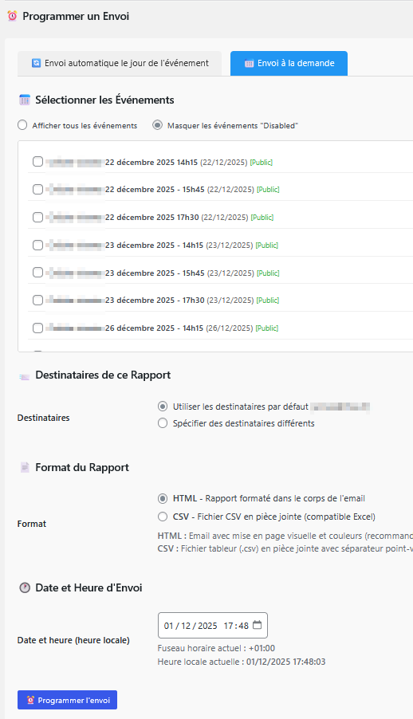
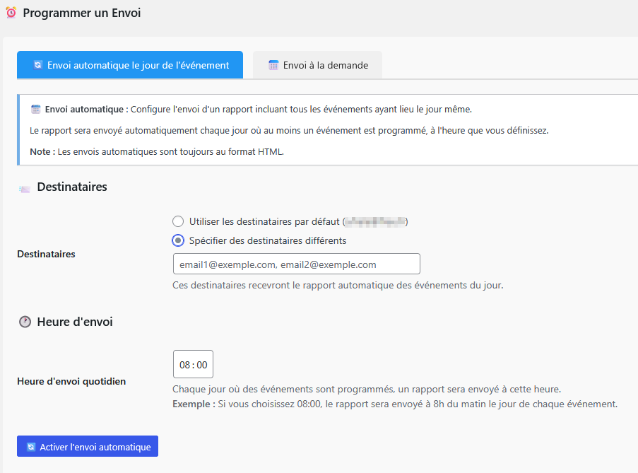

# Plugin WordPress - HelloAsso Events Reports v1.0

Ce plugin permet d'afficher sur votre site WEB, via des shortcode, des informations, récupérées sur Helloasso. Il permet d'afficher le nombres de places vendues pour des événements, afficher le nombre de place par catégories, ou le nombre de places restantes...  

Il permet aussi de programmer l'envoi d'email, contenant les places vendues sous format HTML ou CSV. Cette programmation se fera simplement, en sélectionnant l'événement, la date et l'expéditeur. 

Un paramètre permet aussi de programmer, sur tous les événements en même temps, l'envoi des réservations des événements qui ont lieu le même jour, en indiquant seulement l'heure d'envoi et les destinataires. 

Le rapport sera envoyé automatiquement chaque jour où au moins un événement est programmé, à l'heure que vous avez définie.

#### Envoi à la demande



#### Envoi automatique



## 📋 Installation

### 1. Structure des fichiers

Créez le dossier `/wp-content/plugins/helloasso-events/` avec cette structure :

```
helloasso-events/
├── helloasso-events.php
├── includes/
│   ├── class-helloasso-api.php
│   ├── class-helloasso-email.php
│   ├── class-helloasso-admin.php
│   └── class-helloasso-shortcode.php
├── admin/
│   ├── tests-page.php
│   └── email-reports-page.php
└── assets/
    └── style.css
```

### 2. Configuration dans wp-config.php

Ajoutez vos identifiants API HelloAsso dans `wp-config.php` **AVANT** la ligne `/* C'est tout, ne touchez pas à ce qui suit ! */` :

```php
// Configuration HelloAsso
define('HELLOASSO_CLIENT_ID', 'votre_client_id');
define('HELLOASSO_CLIENT_SECRET', 'votre_client_secret');
define('HELLOASSO_ORGANIZATION_SLUG', 'votre_organization_slug');
```

### 3. Activation

1. Allez dans `Extensions > Extensions installées`
2. Trouvez "HelloAsso Events Reports"
3. Cliquez sur "Activer"

## 🎯 Utilisation

### Menu d'administration

Le plugin ajoute un menu **"HelloAsso"** avec 3 sous-menus :

#### 1. **Présentation**

- Vue d'ensemble de la configuration
- Vérification des identifiants
- Instructions d'utilisation du shortcode

#### 2. **Tests**

- Test de connexion à l'API HelloAsso
- Test d'envoi d'email
- Vider les caches

#### 3. **Rapports email**

- Configuration des destinataires
- Programmation d'envois à dates précises
- Liste des envois programmés

### Shortcode

Pour afficher les événements sur une page ou un article :

```
[helloasso_events]
```

**Options disponibles :**

```
[helloasso_events limit="10"]
[helloasso_events show_sold_out="no"]
[helloasso_events limit="8" show_sold_out="no"]
```

- `limit` : Nombre maximum d'événements (défaut : 10)
- `show_sold_out` : Afficher les événements complets (défaut : "yes")

## 📧 Rapports par email

### Configuration du CRON

Pour des envois précis, configurez un vrai cron système :

```bash
* * * * * curl -s https://votresite.com/wp-admin/admin-ajax.php?action=helloasso_cron >/dev/null 2>&1
```

### Fonctionnalités

- ✅ Programmer des envois à des **dates et heures précises**
- ✅ Plusieurs destinataires (séparés par des virgules)
- ✅ Suivi des statuts (En attente, Envoyé, Expiré)
- ✅ Test d'envoi immédiat
- ✅ Email HTML avec les 3 prochains événements

## 🎨 Informations affichées

Pour chaque événement :

- 📅 Titre et date
- 🎟️ **Total des places vendues**
- 📊 **Détail par catégorie** (Adultes, Enfants, etc.)
- 🔗 Lien vers HelloAsso
- 📍 État (Public, Privé, Brouillon)
- ✅ Badge "COMPLET" si applicable

## 🔧 Architecture technique

### Classes principales

1. **HelloAsso_API** : Communication avec l'API HelloAsso
2. **HelloAsso_Email** : Gestion des rapports par email
3. **HelloAsso_Admin** : Interface d'administration
4. **HelloAsso_Shortcode** : Affichage frontend

### Optimisations

- **Cache** : Token API (30 min), Événements (5 min)
- **cURL natif** : Meilleure performance que wp_remote_*
- **Tri automatique** : Événements par date croissante
- **Évite les doublons** : Système de marquage pour les emails envoyés

## 🐛 Dépannage

### Les événements ne s'affichent pas

1. Allez dans **HelloAsso > Tests**
2. Cliquez sur "Tester la connexion à l'API"
3. Vérifiez les messages d'erreur
4. Videz les caches si nécessaire

### L'email de test échoue

- Vérifiez que PHP peut envoyer des emails (`mail()`)
- Installez un plugin SMTP : "WP Mail SMTP" ou "Post SMTP"
- Vérifiez les logs d'erreur PHP
- Vérifiez le dossier spam

### Les chiffres sont incorrects

- Videz les caches dans **HelloAsso > Tests**
- Attendez 5 minutes (durée du cache)
- Vérifiez dans HelloAsso directement

## 📝 Changelog

### Version 1.0.0

- ✅ Refactorisation complète en classes séparées
- ✅ Menu réorganisé (Présentation, Tests, Rapports email)
- ✅ Programmation d'envois à dates précises
- ✅ Meilleure gestion des erreurs
- ✅ Debug amélioré
- Version initiale

## 📄 Licence

GPL v2 or later

---

**Note :** Ce plugin nécessite un compte HelloAsso et l'accès à leur API.
